# Views

Rendered from the model in [`workspace.dsl`](workspace.dsl). These Mermaid sources render natively in GitHub, GitLab and most markdown viewers with **no build step**. Edit the text; the picture follows.

If you change a view here, change [`workspace.dsl`](workspace.dsl) too — the DSL is the model of record and these are its projections.

---

## 1. Context — who uses the platform

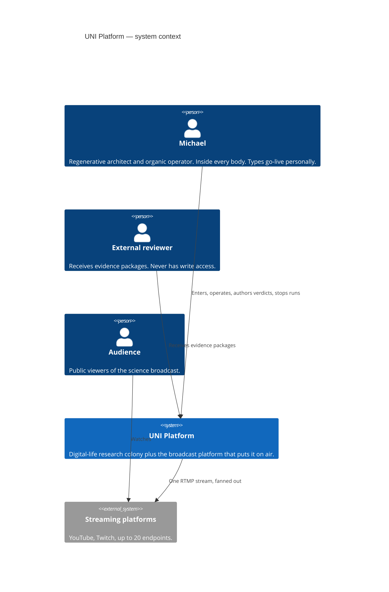

---

## 2. Bodies — the container view

Four bodies. None may be collapsed into another. See [ADR-0001](decisions/ADR-0001-four-bodies.md).

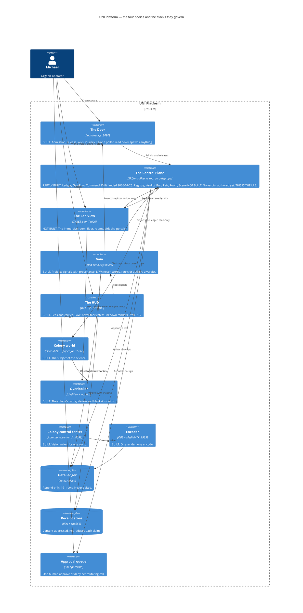

**The one-way rule.** Every arrow into Gaia is a projection. There is no arrow out of Gaia that actuates anything — that is the G-PA fence, enforced by construction: the HTTP surface has no mutating route and no MCP tool is effectful.

---

## 3. Deployment — which body runs where

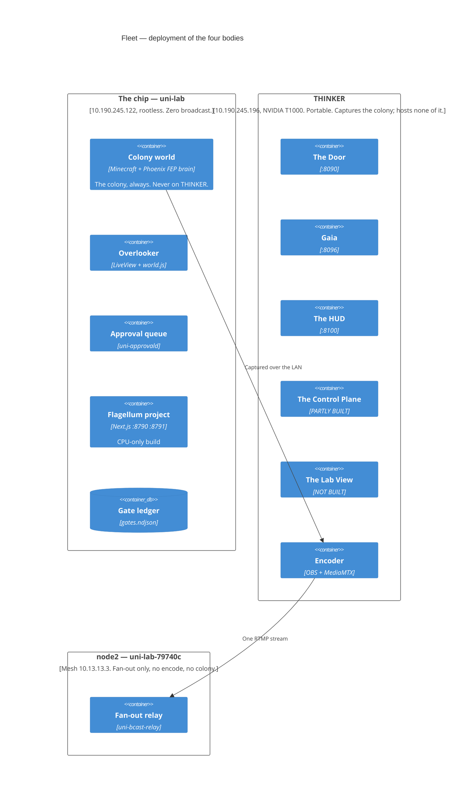

---

## 4. The evidence spine

Steps 1–6 have no home today. Steps 7–9 already work.

```mermaid
flowchart LR
  A["1 register the gate<br/>before the run<br/>falsifier named"] --> B["2 paired run<br/>exactly one variable<br/>or the result is VOID"]
  B --> C["3 observe<br/>continuous time-series<br/>RCON is the authority"]
  C --> D["4 adversarial review<br/>three perspectives<br/>two of them hostile"]
  D --> E["5 author the verdict<br/>PASS PARTIAL FAIL WITHHELD<br/>never a percent"]
  E --> F["6 write the receipt<br/>commit, artifact, log"]
  F --> G["7 append the row<br/>gates.ndjson<br/>never edited"]
  G --> H["8 Gaia projects it<br/>verbatim plus sha256<br/>decides nothing"]
  H --> I["9 HUD and lab show it<br/>drift shown as two<br/>objects that do not align"]

  subgraph NOHOME ["Control Plane — steps 1-6 still have no home (Registry and Verdict are Phase 3)"]
    A
    B
    C
    D
    E
    F
  end
  subgraph WORKS ["Already works"]
    G
    H
    I
  end
```

---

## 5. Gate lifecycle

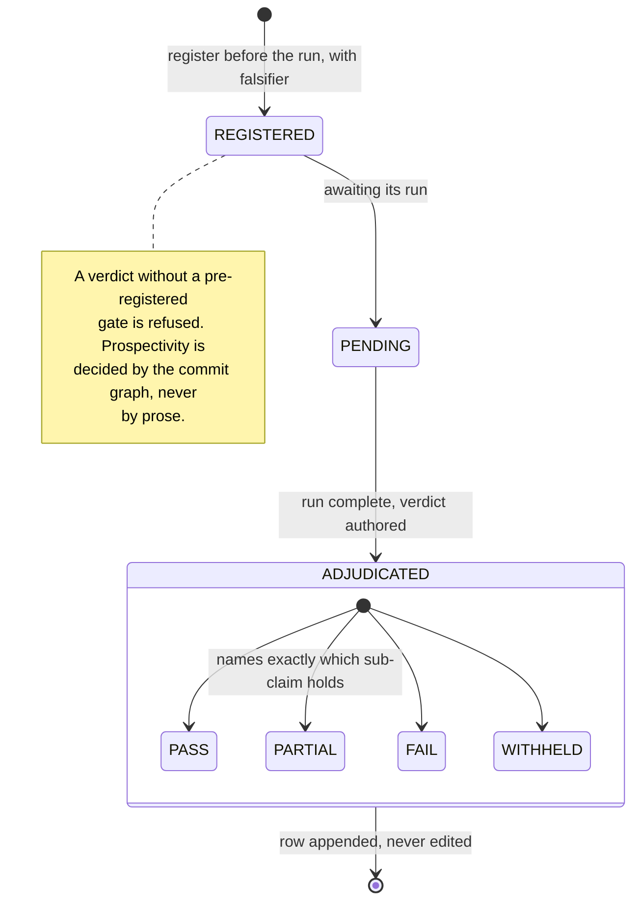

A gate may be **lowered** on receipts. That is the gate working, not a failure.

---

## 6. Run lifecycle

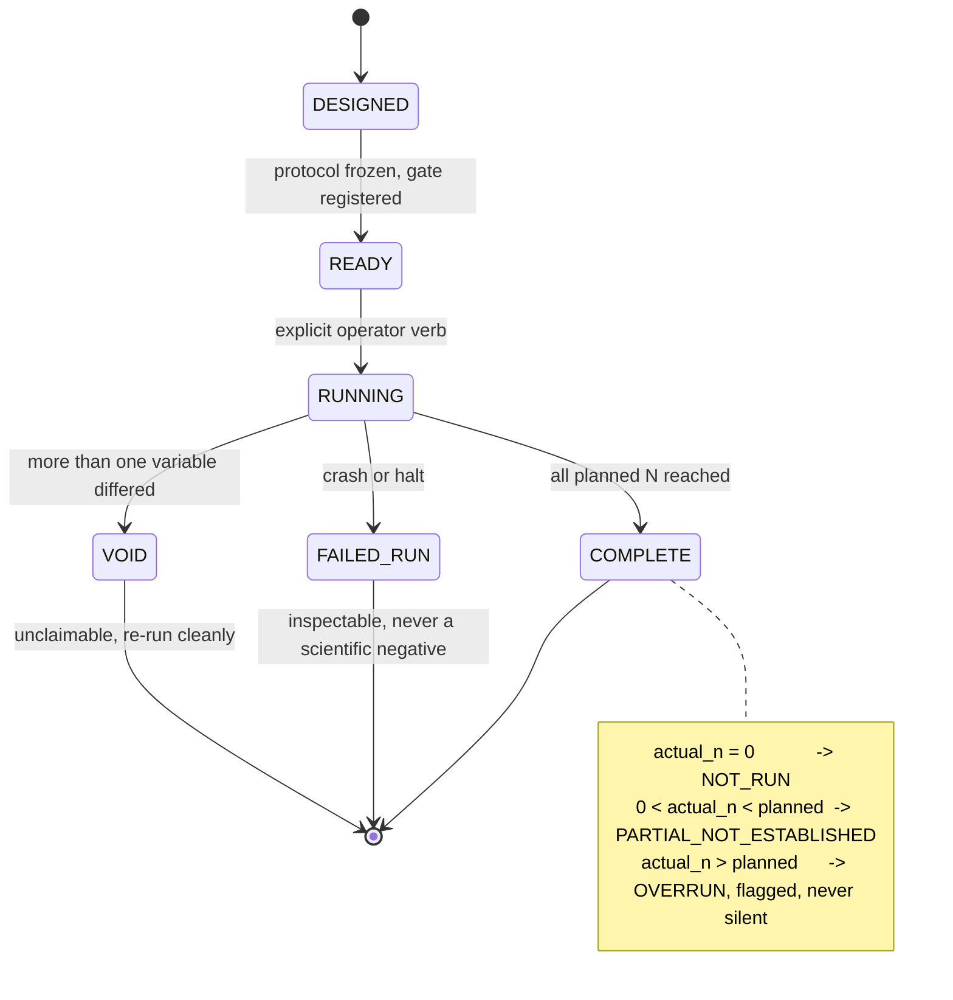

---

## 7. Rooms and airlocks

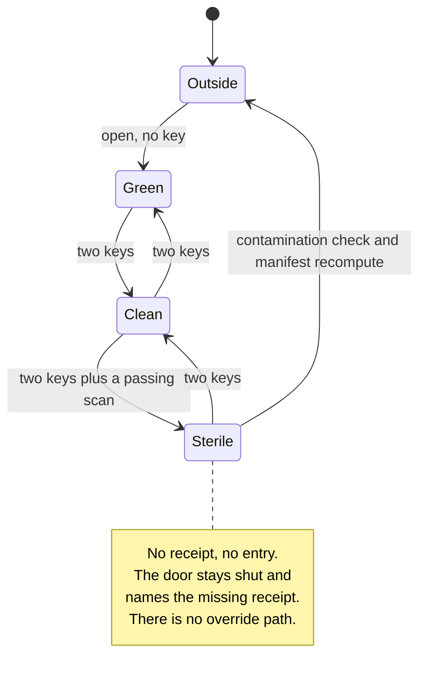

---

## 8. Authoring a verdict — sequence

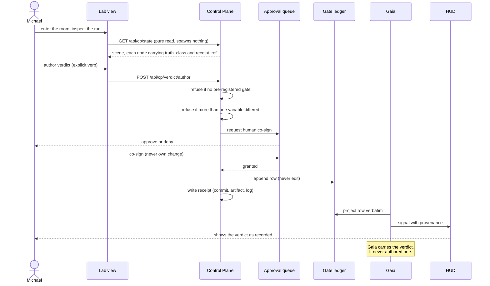

---

## 9. Rendering the truth class

The lab view chooses a **material from the truth class**, not from a style flag. A viewer must read epistemic status from a still screenshot with no text.

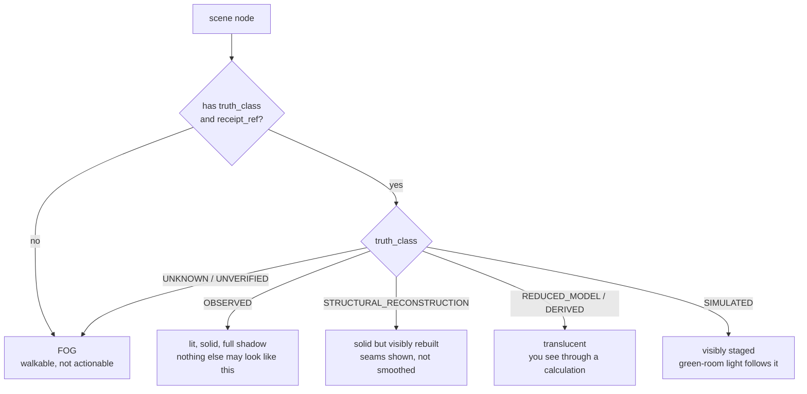

Two rules that stop the room from lying:

1. No frame rate, glow, motion or particle may imply liveness. Liveness renders **only** from a real probe result — a frozen colony looks frozen while every process reports up.
2. Passing a gate renders the named behaviour and nothing more. No material, light or room in this lab can depict awareness, experience or life.

---

## 10. Component view — inside the Control Plane

Rendered from the model: [`generated/structurizr-ControlPlaneComponents.svg`](generated/structurizr-ControlPlaneComponents.svg).

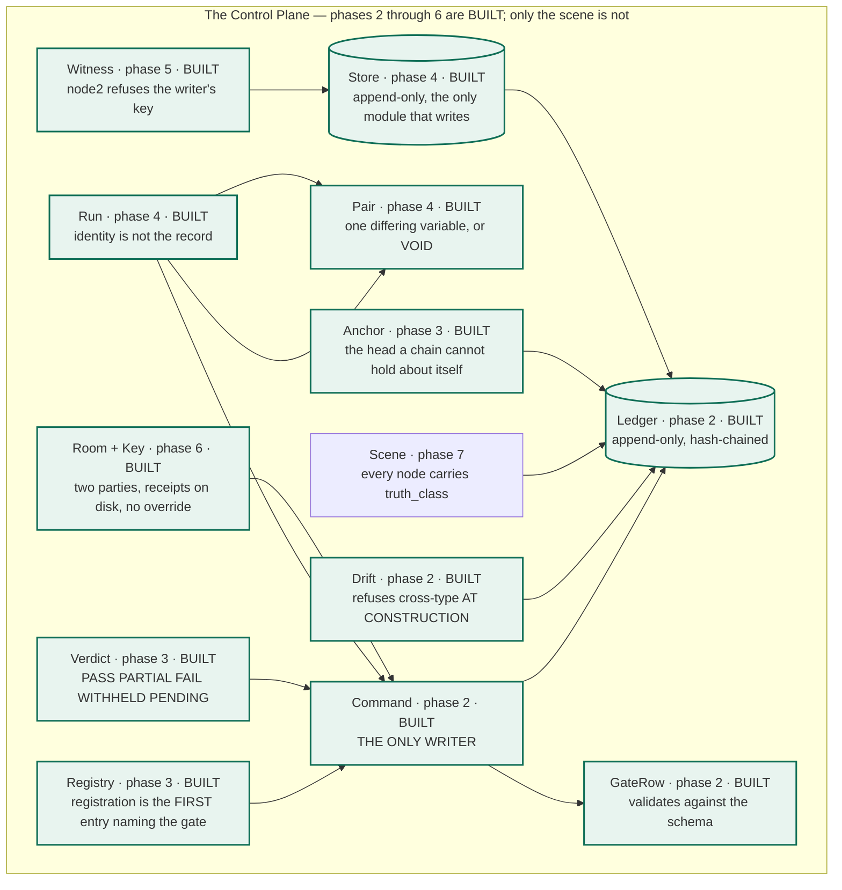

Everything funnels through `Command`. If a write reaches the ledger without passing it, [ADR-0001](decisions/ADR-0001-four-bodies.md) has been violated.

The twelve green components landed across five phases — Phase 2 at `75e2fc4`, Phase 3 at `8ff5591`, Phase 4 at `e6a0529`, Phase 5 at `915bfbb`, Phase 6 at `d524ad1` — 286 tests in total. `Command` is fenced by a runtime writ type-gate **and** a static scan proving no other module in `lib/` reaches the writer — both mutation-tested, because a static scan cannot fail before its subject exists.

---

## 11. Sequence — a claim becomes evidence

The spine, end to end. Steps 7–9 already work. Of steps 1–6, **registration, the ledger append, the row build and verdict authorship now exist**; running paired, observing and adversarial review do not. This is what building the rest means.

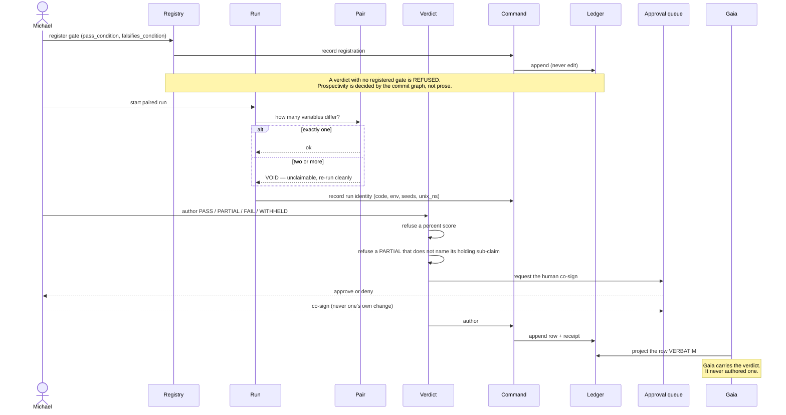

---

## 12. Sequence — the Door admits and releases

```mermaid
sequenceDiagram
  actor M as Michael
  participant D as /door page
  participant L as launcher.cjs :8090
  participant DL as door_lifecycle.cjs
  participant S as the studio

  M->>D: click (a deliberate act)
  D->>L: POST /api/door/open {door:all}
  L->>DL: verb(all, open)
  DL->>DL: append ledger entry (actor, method, prediction)
  DL->>S: bring up, guarded by an OS mutex
  Note over D,S: LAW — a polled READ never spawns anything.<br/>Three independent breakers; any one alone stops a storm.

  D->>L: GET /api/door/journey (pure read, every 3s)
  L-->>D: studio_ready → feature_test → go_live → run_of_show → off_air
  Note over L: The journey OBSERVES. It never actuates.<br/>go_live is typed by hand — no agent can ever do it.
```

---

## 13. Sequence — an airlock, two keys

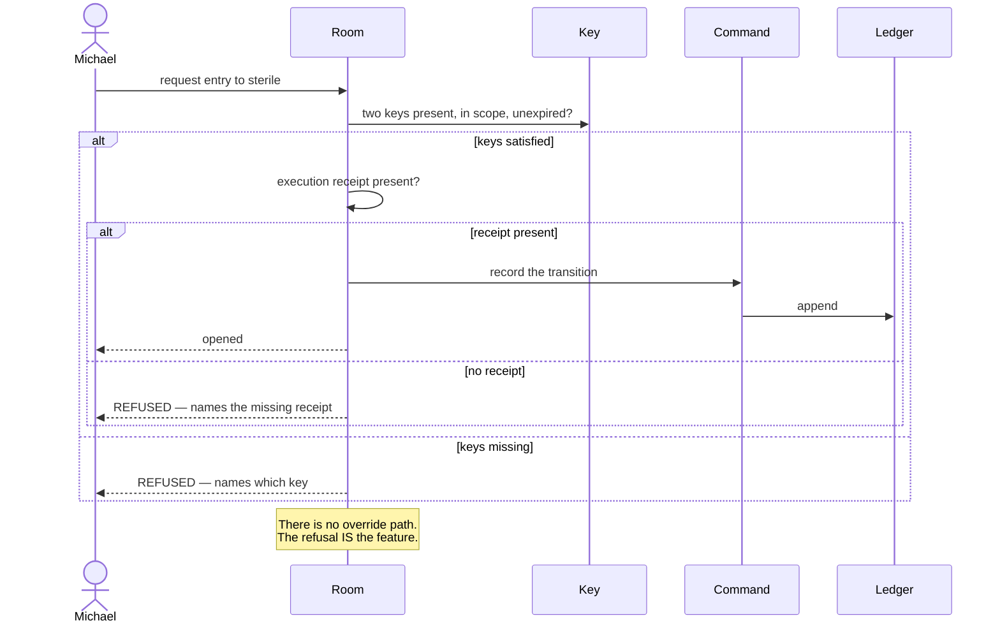

---

## 14. Sequence — emergency stop, mid-run

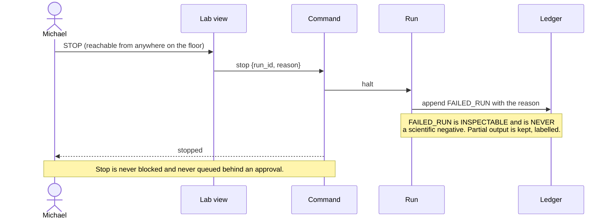

---

## 15. Sequence — a drift is surfaced, and who resolves it

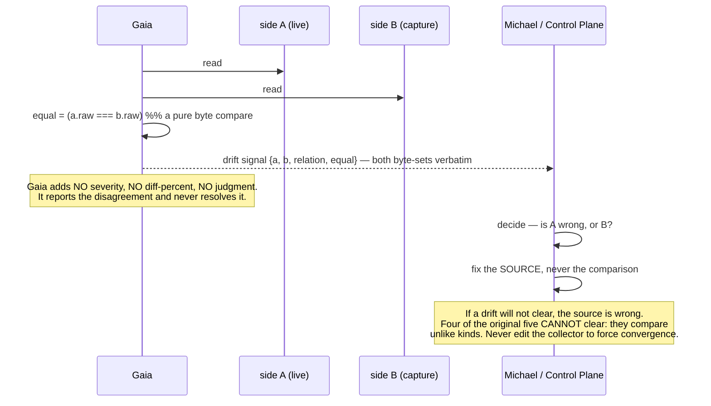
